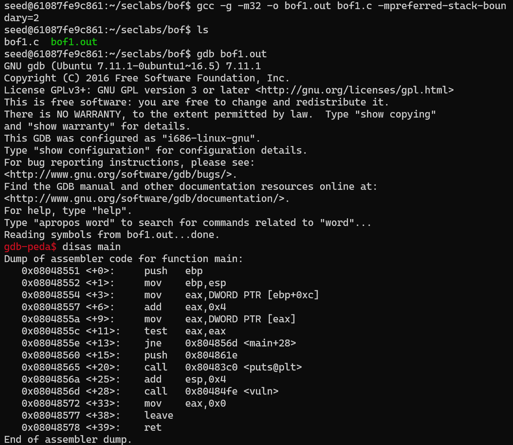
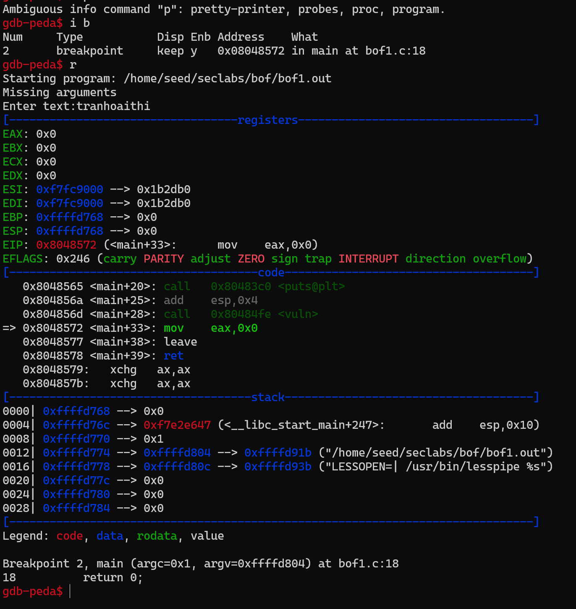

# buffer-flow-lab
| Student ID | Full Name |
| :--- | :--- |
| 21110801 | Tran Hoai Thi |

___lab01:___ bof1

| Labs | Explanation |
| :---| :--- |
| bof1.c |   Ta có mảng chứa 200 bytes trong stack. Để thực thi secretFunc, ta sẽ đặt địa chỉ bộ nhớ của nó vào địa chỉ trả về (eip), để chương trình có thể tràn bộ đệm và dễ dàng thêm địa chỉ của secretFunc vào địa chỉ trả về (eip) chọn 204 bytes.  | 

